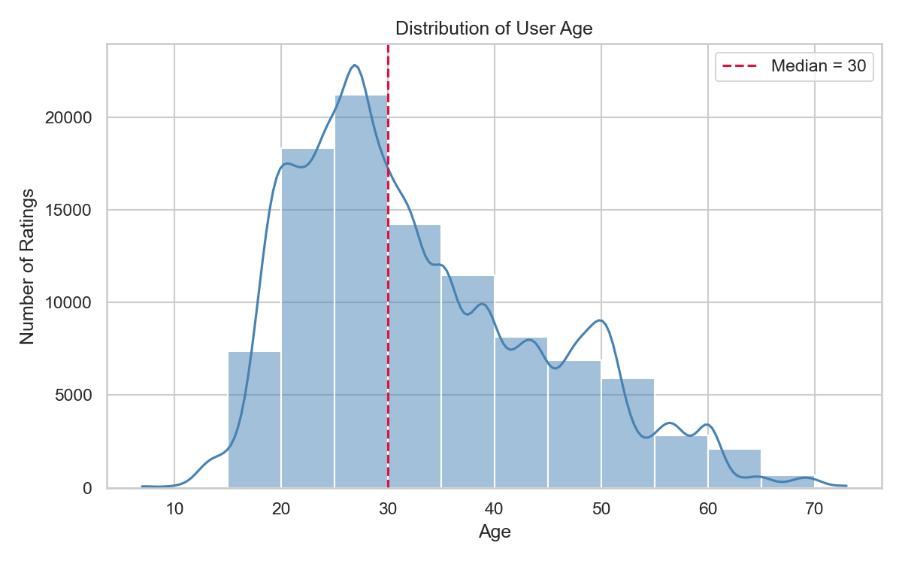
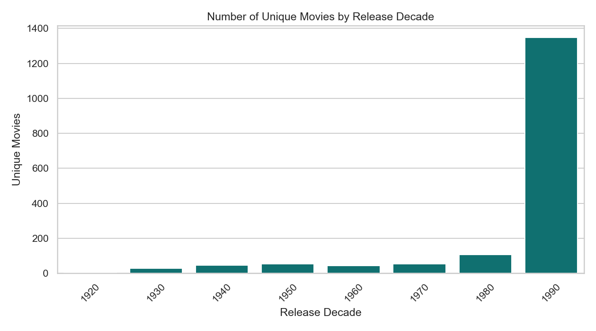
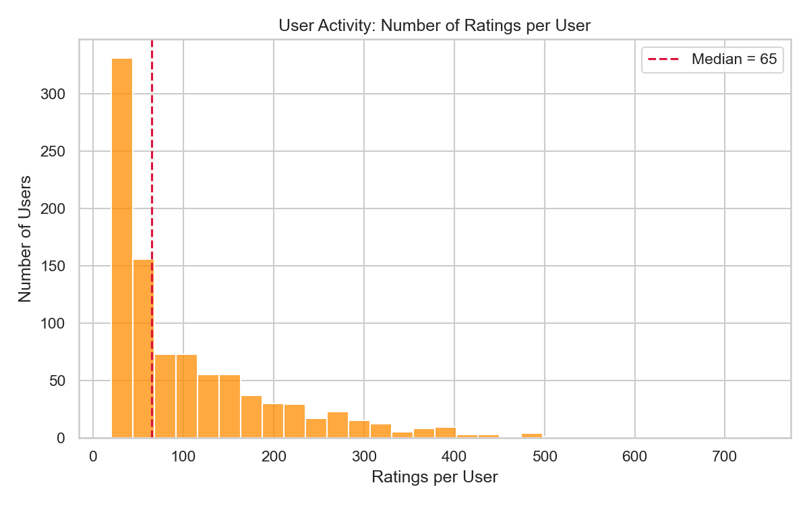
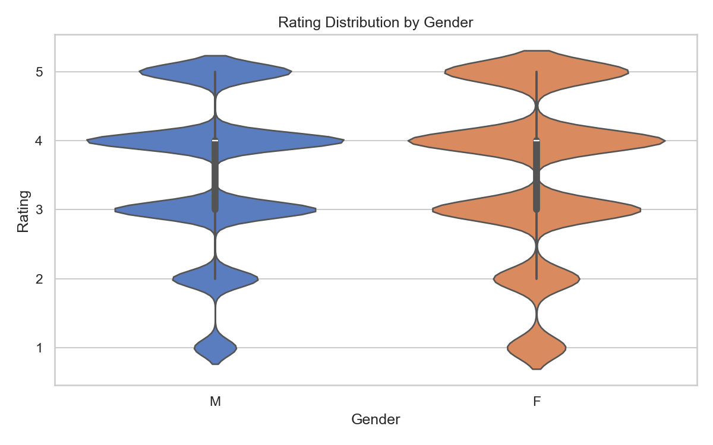
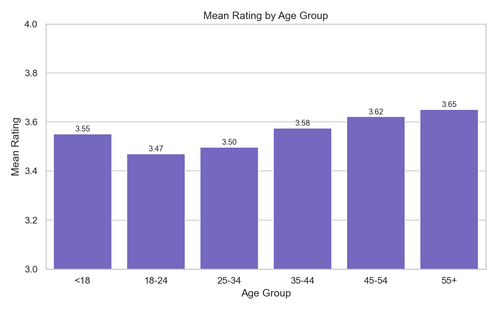
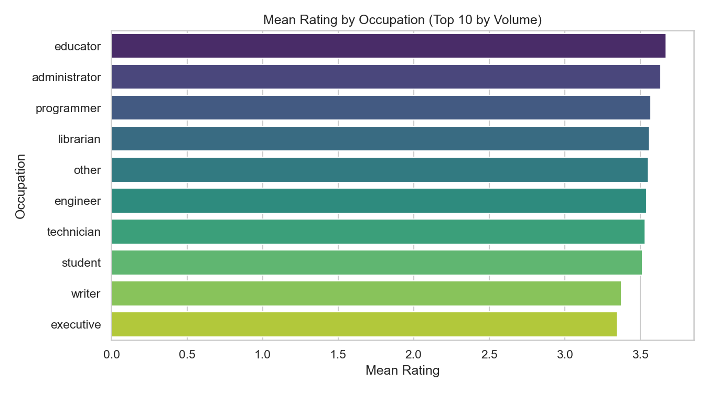
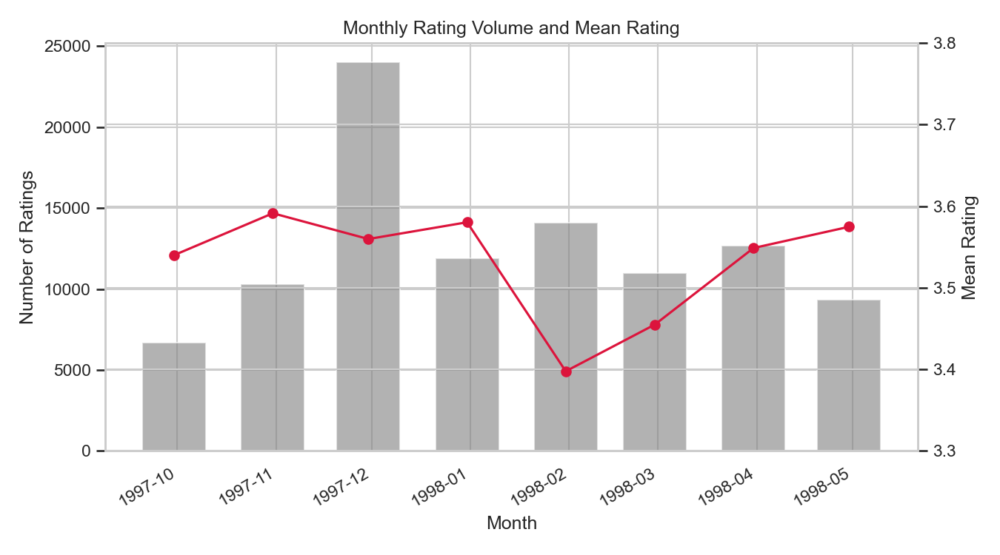
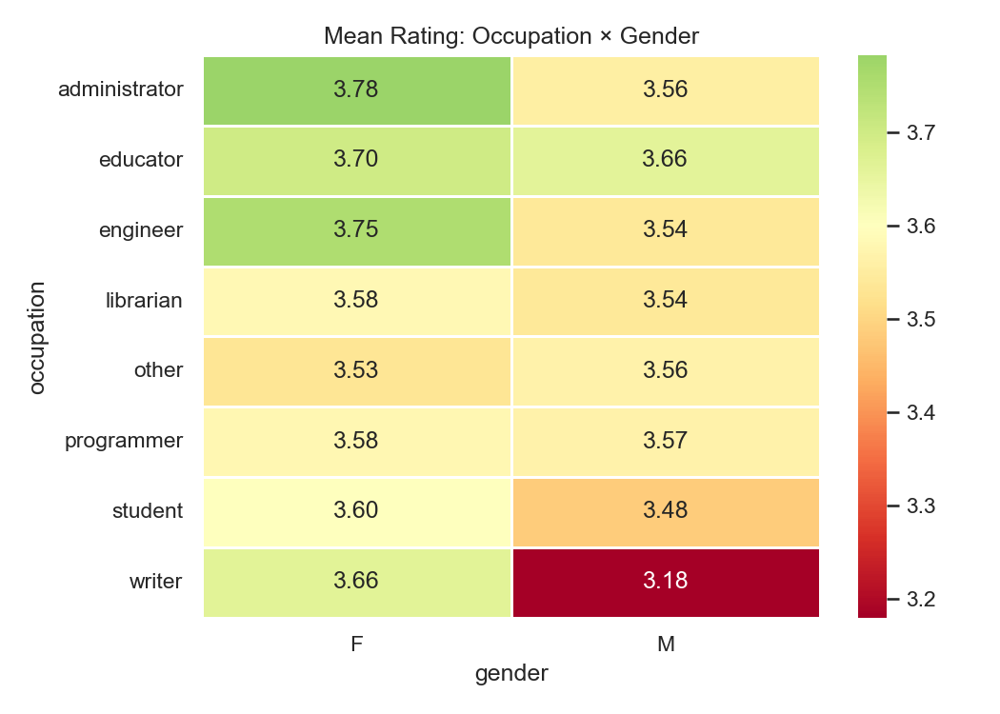

# M4 — Exploratory Data Analytics Report
## MovieLens 100K Recommendation Project

 **Milestone:** M4 (Week 7) · **Date:** June 2026

---

## 1. Introduction

This report presents an exploratory data analysis (EDA) of the MovieLens 100K dataset. The data comprise 100,000 explicit ratings (1–5 stars) from 943 users on 1,682 movies, collected between September 1997 and April 1998. Each user provided at least 20 ratings and basic demographic information (age, gender, occupation, zip code).

The purpose of this EDA is threefold: (1) understand the distributional properties of users, items, and ratings; (2) test initial hypotheses about rating behaviour; and (3) define a concrete modelling question for the next project phase. All analyses were conducted in the companion Jupyter Notebook (`eda_ml100k.ipynb`), which contains ten visualisations with per-chart interpretations.

---

## 2. Data Overview

The cleaned dataset (`../data/processed/ml100k_clean.csv`) contains 100,000 rows and 12 columns after preprocessing (see `../docs/preprocessing_log.md`). Key properties:

| Attribute | Value |
|-----------|-------|
| Users | 943 |
| Movies | 1,682 |
| Ratings | 100,000 |
| Global mean rating | 3.53 |
| Missing values | Negligible (<0.01% on `release_date`) |
| Gender split | 74% male, 26% female |
| Dominant occupation | Student (22% of ratings) |

For multivariate genre analysis, genre labels were joined from the raw `u.item` and `u.genre` files at analysis time (not part of the cleaned CSV). This preserves the minimal preprocessing pipeline while enabling richer EDA.

---

## 3. Univariate Analysis

### 3.1 Rating Distribution (Figure 1)

Ratings are **positively skewed**: grades 4 and 5 together account for **55.4%** of all interactions, while rating 1 appears in only **6.1%** of records. The modal rating is 4 (34.2%).

**Interpretation:** Users tend to rate movies they enjoy rather than movies they dislike. A model optimising RMSE on raw star ratings will be dominated by the 3–5 range and may under-predict rare 1-star ratings. 

### 3.2 User Age Distribution (Figure 2)

The user population is concentrated among young adults. The **median age is 25**, with the highest density in the 18–30 range. Users aged 45 and above form a long but thin tail.

**Interpretation:** Demographic features are heavily weighted toward young users. Any content-based or demographic model will be well-calibrated for this segment but may generalise poorly to older audiences. Cold-start recommendations for atypical age profiles should be treated cautiously.

### 3.3 Movie Release Decade (Figure 3)

The catalogue is dominated by **1990s releases**, consistent with the platform's operating period. Films from before 1970 are scarce.

**Interpretation:** The item catalogue has strong temporal bias. Popularity-based baselines will favour contemporary films. Item features such as `release_year` are necessary to avoid conflating era effects with intrinsic movie quality.

### 3.4 User Activity (Figure 4)

All users rated at least 20 movies (a dataset inclusion rule). Activity is right-skewed: the **median is 65 ratings per user**, while the most active user contributed **737 ratings**.

**Interpretation:** Collaborative filtering similarity will be driven by a subset of power users. We should monitor whether recommendations over-represent tastes of highly active raters and consider normalising or weighting by user activity during modelling.

---

## 4. Bivariate Analysis

### 4.1 Rating vs Gender (Figure 5)

Male users submitted **74,260** ratings (74%) versus **25,740** from female users (26%). Mean ratings are virtually identical: **M = 3.53, F = 3.53**; medians are both 4.

**Interpretation:** Gender does not meaningfully separate rating leniency in this dataset. It may still capture taste differences (which movies are rated, not how highly), but it is unlikely to be a strong main effect for rating magnitude prediction.

### 4.2 Rating vs Age Group (Figure 6)

Mean ratings vary from **3.47 (ages 18–24)** to **3.65 (ages 55+)**. The relationship is broadly **monotonic**: older users rate more generously.

**Interpretation:** This contradicts the intuition that younger users are harsher critics across all ages. The stingiest segment is young adults (18–24), not seniors. Age should enter the model as binned categories rather than a linear predictor.

### 4.3 Rating vs Occupation (Figure 7)

Among the ten most active occupations, mean ratings range from roughly **3.5 to 3.8**. Students — the largest group (21,957 ratings, mean 3.52) — sit near the global average. Educators trend higher (mean 3.67).

**Interpretation:** Occupation captures subtle lifestyle-related differences, but effect sizes are small. It is more useful as a sparse categorical user feature in matrix factorisation than as a standalone predictor.

### 4.4 Rating Activity Over Time (Figure 8)

Monthly rating volume grew from late 1997 through early 1998, peaking around **March 1998**. Mean monthly rating remained stable between **3.4 and 3.7**.

**Interpretation:** Platform engagement increased over the collection window, but average leniency did not drift substantially. A random train/test split is acceptable for this dataset, though a temporal split would better simulate production deployment.

---

## 5. Multivariate Analysis

### 5.1 Gender × Occupation Heatmap (Figure 9)

When mean rating is plotted across the cross-tabulation of gender and the top eight occupations, several cells deviate from row or column averages. For example, male engineers and female librarians show distinct combinations not explained by gender or occupation alone.

**Interpretation:** Interaction effects exist between demographic variables. A model using only main effects (e.g., separate gender and occupation averages) will miss these joint patterns. Latent-factor models (matrix factorisation) or explicit interaction terms are better suited to capture this structure.

### 5.2 Genre × Release Decade Heatmap (Figure 10)

Combining the six most-rated genres with release decade reveals heterogeneous patterns. **Drama** and **Romance** maintain relatively high averages across decades, while **1990s films overall score lower** (mean 3.40) than films from the 1940s–1970s (means 3.75–4.01).

**Interpretation:** Genre and release era interact: a user's expected rating depends jointly on content type and vintage. Item-side features for modelling should include both genre and `release_year`. The low 1990s average also suggests a "recent-release penalty" — possibly because users rate popular new films they feel neutral about, whereas older films in the catalogue are classics pre-selected for quality.

---

## 6. Revised Hypotheses

The table below records initial hypotheses (formulated before EDA, based on domain intuition and prior recommender-system literature) and their revision after visual and statistical exploration.

| ID | Initial Hypothesis | EDA Finding | Revised Hypothesis |
|----|-------------------|-------------|-------------------|
| H1 | Younger users give higher ratings | Ages 18–24 give the *lowest* mean (3.47); ratings rise with age to 3.65 for 55+ | **Revised:** Older users are more generous raters; young adults (18–24) are the most critical segment |
| H2 | Male and female users differ substantially in rating behaviour | Means are virtually equal (3.53 vs 3.53); medians identical | **Rejected** as a main effect on rating magnitude; gender may still affect *which* movies are chosen |
| H3 | Newer releases receive higher ratings | 1990s movies average 3.40 vs 3.75–4.01 for 1940s–1980s | **Reversed:** Older catalogue films score higher; newer releases face a popularity-driven neutrality penalty |
| H4 | Students dominate volume and skew the average | Students are 22% of ratings but mean 3.52 ≈ global 3.53 | **Partially confirmed** on volume; **rejected** on skew — students are representative, not biased |
| H5 | Rating activity increased over the collection period | Monthly volume rose steadily to March 1998; mean rating stable | **Confirmed** for volume growth; **refined:** no significant rating-inflation drift over time |

These revised hypotheses directly inform feature selection and evaluation design for the modelling phase.

---

## 7. Modelling Question

Based on the EDA findings, our team will pursue the following modelling question:

> **Given a user ID, their demographic profile (age, gender, occupation), and their history of past ratings, predict the star rating (1–5) that the user would assign to a movie they have not yet seen, where each movie is described by its title, release year, and genre.**

### Rationale

1. **Explicit rating prediction** is the natural next step for MovieLens 100K and supports both RMSE evaluation and derivation of Top-N recommendations via score ranking.
2. **User demographics** show measurable (if modest) age and occupation effects; gender alone is weak but included for completeness.
3. **Item features (genre, release year)** are justified by the multivariate heatmap showing joint genre–era effects and the reversed new-release hypothesis.
4. **Positive skew** (Section 3.1) motivates reporting MAE and per-class accuracy alongside RMSE, and optionally a secondary binary "high rating (≥4)" classification task.

### Planned Approach

| Component | Choice |
|-----------|--------|
| Baseline | Global mean, user-mean, item-mean |
| Primary model | Matrix factorisation (e.g., SVD / ALS) with user and item latent factors |
| Enhanced model | Hybrid model incorporating genre and release-year item features |
| Train/test split | Official 5-fold split (`u1.base` / `u1.test`) from the raw dataset |
| Primary metric | RMSE on held-out ratings |
| Secondary metrics | MAE; Precision@10 and Recall@10 for Top-N recommendation |

### Known Risks

- **Rating imbalance** toward 3–5 may inflate RMSE-based satisfaction while masking poor low-rating prediction.
- **Gender imbalance** (74% male) may reduce signal for female-user segments.
- **Temporal catalogue bias** toward 1990s films may hurt generalisation to older or niche titles.

---

## 8. Conclusion

The MovieLens 100K dataset is well-suited for collaborative filtering research: it is dense (every user rated ≥20 films), has rich side information, and exhibits clear but nuanced patterns. EDA revealed a positively skewed rating distribution, a young and active user base, and interaction effects between demographics and between genre and release era. Several initial hypotheses were overturned — notably that newer films score higher and that gender drives rating leniency — demonstrating the value of systematic exploration before modelling.

The companion notebook (`eda_ml100k.ipynb`) reproduces all ten visualisations with executable code. 

---

## References

- Project preprocessing log: `../docs/preprocessing_log.md`
- Project data quality summary: `../docs/data_quality.md`
