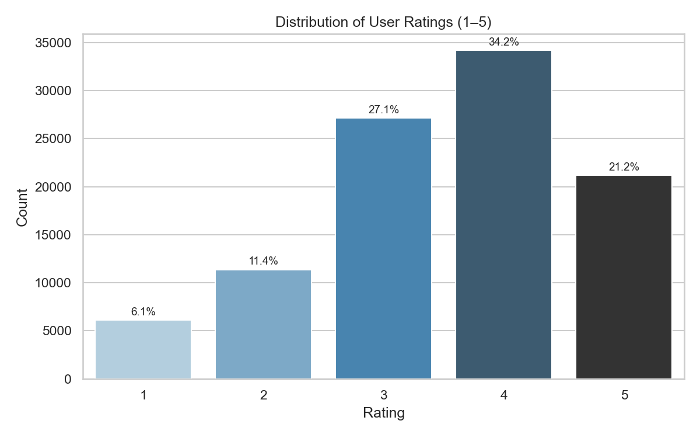
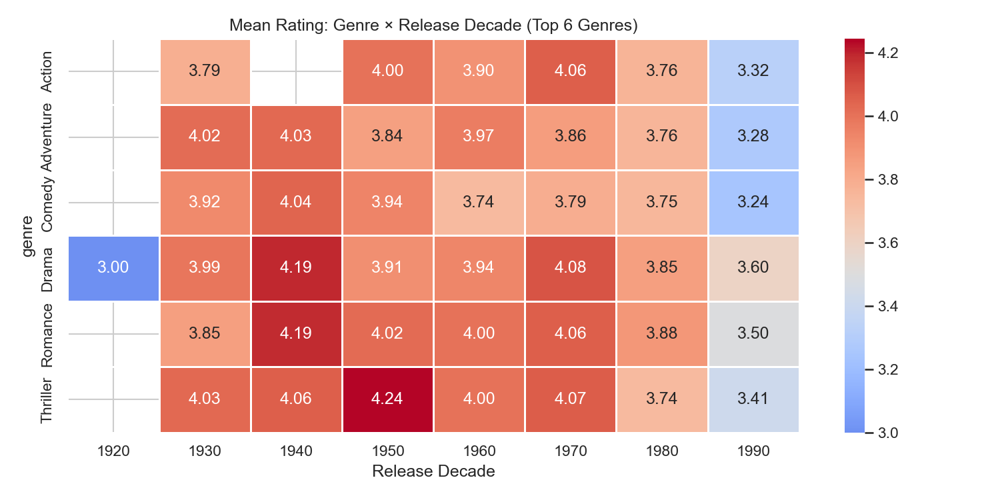
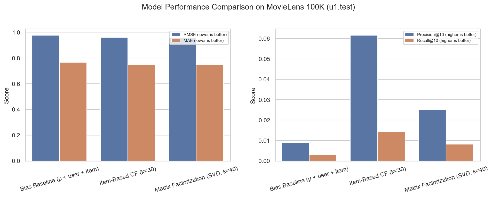
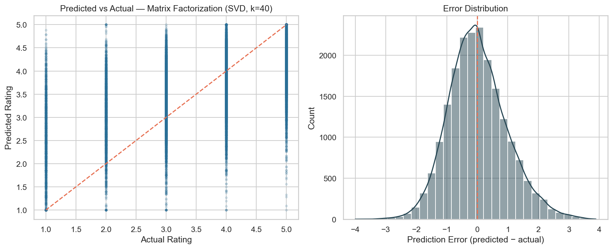
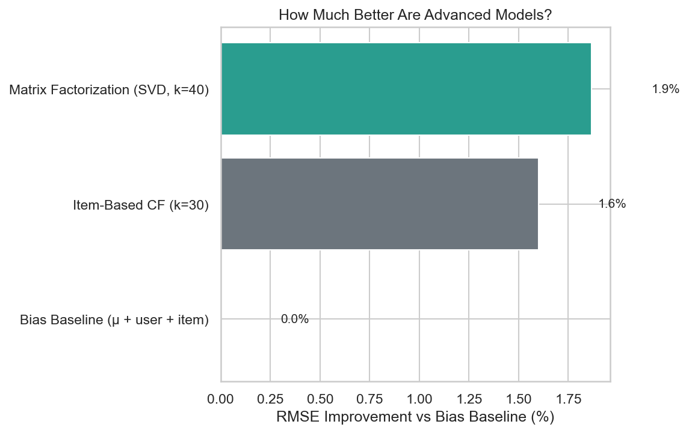
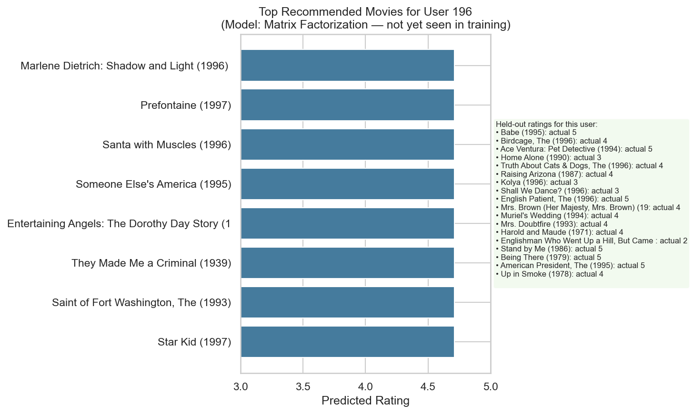

# Final Project Report
## Understanding User Preferences through Latent Factors

**Course:** INFO 442 · **Milestone:** M6 (Final Delivery) · **Date:** June 2026

**Team:** Chang Liu (刘畅), Bolun Feng (冯博伦), Jiajin Guo (郭甲进), Shixuan Li (李仕轩)

---

## Abstract

This report presents the complete lifecycle of a recommender-system research project built on the MovieLens 100K dataset. We formulated a scientific question about whether matrix factorization (MF) can outperform neighbourhood-based collaborative filtering (CF) for star-rating prediction. After preprocessing 100,000 ratings, conducting exploratory data analysis (EDA), and training three models on the standard `u1` train/test split, we find that **MF achieves the lowest RMSE (0.959) and MAE (0.750)**, while **item-based CF achieves the highest Top-10 recommendation precision (6.2%)**. These results partially confirm our initial hypothesis: latent-factor models improve rating accuracy, but the gain is modest and does not dominate on every metric. We recommend a **dual-model deployment strategy**—MF for predicted star ratings, item-CF for curated recommendation lists—and document limitations including demographic skew, and rating compression toward 3–4 stars.

---

## 1. Introduction

### 1.1 Domain and Motivation

Streaming platforms such as Netflix and Hulu offer catalogues of thousands of titles. This abundance creates an **information overload** problem: users struggle to discover content aligned with their tastes. Recommendation engines are the primary mitigation; industry estimates suggest that more than 80% of viewing on major platforms originates from recommended content.

Improving rating prediction and Top-N recommendation quality directly affects user satisfaction, engagement, and catalogue utilisation. Our project investigates a foundational question in recommender-system design: **when should a platform prefer latent-factor models over classical neighbourhood methods?**

### 1.2 Scientific Question

> **Can latent factor models (specifically matrix factorization) significantly outperform traditional neighborhood-based collaborative filtering methods in predicting user-movie ratings on the MovieLens 100K dataset?**

### 1.3 Initial Hypothesis

We hypothesised that matrix factorization would yield superior performance compared to baselines (global mean, item-based CF) because:

1. **Sparsity:** The rating matrix is 93.7% sparse; MF maps users and items into a dense latent space.
2. **Hidden structure:** MF can capture taste dimensions (e.g., genre combinations) not explicit in metadata.
3. **Expected magnitude:** We anticipated a 10–15% RMSE reduction relative to simple baselines.

As documented in Sections 4, 5, and 7, EDA and modelling results **revised and partially challenged** this hypothesis.

### 1.4 Project Scope and Deliverables

This final report integrates all project phases:

| Phase | Focus | Key artefact |
|-------|-------|--------------|
| M1 | Proposal | Research question, team roles |
| M2 & M3 | Data engineering | `ml100k_clean.csv`, quality docs |
| M4 | Exploratory analytics | 10 visualisations, revised hypotheses |
| M5 | Modelling | Three models, four metrics, stakeholder charts |
| M6 | Deployment & synthesis | This report, model card, demo, presentation |

Companion notebooks and milestone reports are cited throughout; reproducible code lives in `M4/eda_ml100k.ipynb` and `M5/modelling_ml100k.ipynb`.

### 1.5 Team Responsibilities

| Member | Role | Contributions |
|--------|------|---------------|
| Chang Liu | Data Engineer | Preprocessing, EDA, data cleaning |
| Bolun Feng | Baseline Developer | Bias baseline, item-based CF |
| Jiajin Guo | Algorithm Engineer | Matrix factorization, evaluation |
| Shixuan Li | Evaluation & Lead | Visualisation, final report, presentation |

---

## 2. Dataset and Ethics

### 2.1 Source and Description

We use **MovieLens 100K**, released by GroupLens Research. It contains 100,000 explicit star ratings (1–5) from 943 users on 1,682 movies, collected between September 1997 and April 1998. Each user rated at least 20 movies and provided demographics (age, gender, occupation, zip code).

| Attribute | Value |
|-----------|-------|
| Users | 943 |
| Movies | 1,682 |
| Ratings | 100,000 |
| Sparsity | 93.7% |
| Global mean rating | 3.53 |
| Train/test split | `u1.base` (80,000) / `u1.test` (20,000) |

### 2.2 Ethical Considerations

The dataset is fully de-identified: numerical user IDs, no personally identifiable information (PII). We use it strictly for academic research in compliance with GroupLens terms of use. Nevertheless, **demographic imbalance** (74% male raters) and **popularity bias** in recommendations remain ethical concerns for fair deployment; we discuss these in Section 8.

---

## 3. Data Preprocessing (M2 & M3)

### 3.1 Acquisition and Pipeline

Raw data were obtained from the official GroupLens release and stored under `M1/ml-100k/` and `M2 & M3/data/raw/ml-100k/`. The preprocessing pipeline merged three core files:

- `u.data` — user ID, item ID, rating, Unix timestamp  
- `u.item` — movie metadata and 19 genre flags  
- `u.user` — user demographics  

Output: **`M2 & M3/data/processed/ml100k_clean.csv`** (100,000 rows × 12 columns).

### 3.2 Cleaning Steps

1. **Validation:** Enforced rating bounds [1, 5]; zero out-of-range rows removed.  
2. **Deduplication:** Exact duplicate rows removed (0 rows).  
3. **Parsing:** Timestamps converted to datetime; `release_date` parsed with invalid dates set to NaT.  
4. **Feature derivation:** Added `rating_date` and `release_year`.  
5. **Missing values:** No imputation applied; `release_date` null rate < 0.01%.

### 3.3 Design Rationale

Transformations were kept **minimal and reversible**. We avoided normalisation or imputation so downstream models retain the original rating signal. Full run metadata is recorded in `M2 & M3/docs/preprocessing_log.md`; null rates and rating distributions appear in `M2 & M3/docs/data_quality.md`.

### 3.4 Schema Summary

| Column | Type | Description |
|--------|------|-------------|
| user_id, item_id | int | Identifiers |
| rating | int | Star rating 1–5 |
| timestamp, rating_date | datetime | When rated |
| movie_title, release_date, release_year | str/datetime/float | Item metadata |
| age, gender, occupation, zip_code | int/str | User demographics |

---

## 4. Exploratory Data Analysis (M4)

### 4.1 Objectives

EDA served three purposes: (1) characterise users, items, and ratings; (2) test pre-modelling hypotheses; (3) define a concrete modelling question. Ten visualisations (univariate, bivariate, multivariate) were produced in `M4/eda_ml100k.ipynb`.

### 4.2 Univariate Findings

**Rating distribution** (Figure 1) is **positively skewed**: ratings 4 and 5 account for 55.4% of interactions; rating 1 appears in only 6.1%. The modal rating is 4 (34.2%). Users predominantly rate movies they enjoy—a pattern that later causes models to compress predictions toward 3–4 stars.



**User age** concentrates among young adults (median 25). **Catalogue composition** is dominated by 1990s releases. **User activity** is right-skewed (median 65 ratings per user; maximum 737), meaning a subset of power users disproportionately influences collaborative signals.

### 4.3 Bivariate and Multivariate Findings

- **Gender:** Mean ratings identical for male and female users (3.53); gender is a weak predictor of rating *magnitude*.  
- **Age:** Mean rating rises monotonically from 3.47 (ages 18–24) to 3.65 (55+); older users are more generous raters.  
- **Occupation:** Students contribute 22% of ratings but mean 3.52 ≈ global average; educators rate slightly higher (3.67).  
- **Time:** Monthly rating volume grew through March 1998; mean monthly rating remained stable (3.4–3.7).  
- **Genre × decade:** Drama and Romance maintain high averages across eras; **1990s films score lower** (mean 3.40) than 1940s–1970s classics (3.75–4.01).



### 4.4 Revised Hypotheses

| ID | Initial hypothesis | Outcome after EDA |
|----|-------------------|-------------------|
| H1 | Younger users give higher ratings | **Revised** — 18–24 give lowest mean (3.47) |
| H2 | Gender drives rating behaviour | **Rejected** for magnitude; may affect movie choice |
| H3 | Newer releases score higher | **Reversed** — older catalogue films score higher |
| H4 | Students skew the average | **Partially confirmed** on volume only |
| H5 | Rating activity grew over time | **Confirmed**; no rating-inflation drift |

### 4.5 Modelling Question Defined

> Given a user ID, their demographic profile, and rating history, predict the star rating (1–5) they would assign to an unseen movie described by title, release year, and genre.

Planned evaluation: RMSE (primary), MAE, Precision@10, Recall@10 on the official `u1` split.

---

## 5. Modelling and Evaluation (M5)

### 5.1 Experimental Setup

All models were trained on **`u1.base`** (80,000 ratings) and evaluated on **`u1.test`** (20,000 held-out ratings). Each test pair (user, movie) was unseen during training for that user.

We report four metrics:

| Metric | Purpose |
|--------|---------|
| RMSE | Standard rating-accuracy benchmark; penalises large errors |
| MAE | Interpretable average star error |
| Precision@10 | Share of Top-10 recommendations with test rating ≥ 4 |
| Recall@10 | Share of user's liked test movies captured in Top-10 |

### 5.2 Models

**Model 1 — Bias Baseline**  
\(\hat{r}_{ui} = \mu + b_u + b_i\)  
Interpretable lower bound capturing global mean, user leniency, and item quality.

**Model 2 — Item-Based CF (k = 30)**  
Predictions from the 30 most similar items (cosine similarity on mean-centered co-ratings) that the user already rated. Classic neighbourhood baseline from our proposal.

**Model 3 — Matrix Factorization (Truncated SVD, k = 40)**  
\(\hat{r}_{ui} = \mu + b_u + b_i + p_u^\top q_i\)  
Latent-factor model testing our core research question; 40 components, bias-centered residuals.

### 5.3 Results

**Table 1 — Model performance on u1.test**

| Model | RMSE ↓ | MAE ↓ | Precision@10 ↑ | Recall@10 ↑ |
|-------|--------|-------|----------------|-------------|
| Bias Baseline | 0.977 | 0.766 | 0.009 | 0.003 |
| Item-Based CF (k=30) | 0.962 | 0.751 | **0.062** | **0.014** |
| Matrix Factorization (k=40) | **0.959** | **0.750** | 0.025 | 0.008 |



**Key findings:**

1. **MF wins on rating prediction** — RMSE improves 1.9% vs. bias baseline (0.977 → 0.959); MAE improves 2.1%. This **directionally supports** our hypothesis but falls far short of the projected 10–15% gain.  
2. **Item-CF wins on Top-10 recommendation** — Precision@10 of 6.2% vs. 2.5% for MF. Neighbourhood methods better surface titles users would "like" even when star-level RMSE is slightly worse.  
3. **All models compress toward 3–4 stars** — Consistent with M4 positive skew; 1-star ratings are under-predicted.



### 5.4 Stakeholder Interpretation

| Product goal | Recommended model | Evidence |
|--------------|-------------------|----------|
| Display predicted star rating | Matrix Factorization | Lowest RMSE / MAE |
| Curate Top-10 watchlist | Item-Based CF | Highest P@10 |
| Explainability | Bias Baseline | Decomposable offsets |





---

## 6. Deployment Strategy (M6)

### 6.1 Design Decision

Because no single model dominates all metrics, we propose a **dual-model deployment**:

| Component | Model | Function |
|-----------|-------|----------|
| Rating service | Matrix Factorization | Predict \(\hat{r}_{ui}\) for UI display and ranking |
| Recommendation service | Item-Based CF | Generate Top-N lists optimising "would watch" precision |
| Fallback | Bias Baseline | Cold-start users/items with no history |

This architecture aligns technical performance with product priorities identified in Section 5.4.

### 6.2 Deployment Architecture

The deployed demo is a **web application** (`M6/demo/`) that presents precomputed recommendations from our three M5 models. This design separates **offline model training** from **browser-based inference display**, which is appropriate for a course demo and recorded walkthrough.

```
Offline (export_demo_data.py)          Browser (index.html)
─────────────────────────────          ────────────────────
Load u1.base, u.user, u.item    →      Load demo_data.js
Train Bias / Item-CF / MF              Select user (6 samples)
Top-10 per user × 3 models      →      Select model (3 options)
Export demo_data.json / .js            Render profile, metrics, Top-10 cards
```

**Components:**

| File | Role |
|------|------|
| `export_demo_data.py` | Trains all three models on `u1.base`; exports Top-10 lists for six sample users (IDs: 196, 253, 308, 122, 1, 42) |
| `demo_data.json` / `demo_data.js` | Precomputed recommendations and model metrics |
| `index.html` | Interactive UI: user profile, model metrics (RMSE, MAE, P@10), training history, ranked movie cards with predicted stars |

**No backend server is required** — opening `index.html` in a browser loads `demo_data.js` directly.

### 6.3 Demo Deliverable

The team delivered a **working web demo** and a **recorded walkthrough video** (submitted with the final project package; see `M6/demo/`). The interface supports:

1. **User selection** — six representative MovieLens users with age, gender, and occupation  
2. **Model switching** — Matrix Factorization, Item-Based CF, or Bias Baseline  
3. **Top-10 recommendations** — title, release year, predicted star rating, and visual star display  
4. **Context panel** — model-level RMSE/MAE/P@10 and the user's recent training ratings  

**Suggested demo flow** (for presentation video): select User 196 → Matrix Factorization → view Top-10 → switch to Item-Based CF and compare lists.

Demo source and data live in `M6/demo/`. The companion **model card** (`M6/model_card.md`) documents intended use, metrics, and limitations.

### 6.4 Operational Considerations

**Current demo (static deployment):** Recommendations are precomputed offline by `export_demo_data.py` and served from `demo_data.js`. The browser performs no model inference at runtime, so latency is negligible and no backend is required.

**Production extension (not implemented):** A live system would need online Item-CF similarity lookup (O(k) per item), periodic retraining as new ratings arrive, and monitoring of RMSE, P@10, and subgroup metrics by gender/age to detect fairness drift. Full-catalog ranking for 943 users × ~1,600 items would require approximate nearest neighbours or pre-filtering at scale.

---

## 7. Answer to the Scientific Question

**Can matrix factorization significantly outperform neighbourhood CF on MovieLens 100K?**

| Criterion | Answer |
|-----------|--------|
| RMSE / MAE (rating prediction) | **Yes, slightly.** MF RMSE 0.959 vs. Item-CF 0.962 (−0.3%) and vs. bias 0.977 (−1.9%). |
| Precision@10 (recommendation) | **No.** Item-CF (6.2%) substantially outperforms MF (2.5%). |
| Magnitude vs. initial hypothesis | **Partially.** Improvement is modest, not the projected 10–15%. |
| Overall | MF is the better **rating** model; Item-CF is the better **recommendation-list** model. A hybrid deployment is warranted. |

Our core research question therefore receives a **nuanced affirmative**: latent-factor models outperform neighbourhood methods on the primary rating-accuracy metric, but "significantly" must be qualified—both statistically and from a product perspective where Top-N quality may matter more than RMSE.

---

## 8. Limitations and Failure Modes

### 8.1 Data and Evaluation

- **Single split:** Results reflect `u1` only; 5-fold cross-validation would strengthen confidence.  
- **Demographic skew:** 74% male raters; models may under-serve female users.  
- **Temporal bias:** 1990s-dominated catalogue limits generalisation to other eras.  
- **Static benchmark:** MovieLens 100K is historical; patterns may not transfer to modern streaming catalogues.

### 8.2 Model Failure Modes

| Failure mode | Symptom | Mitigation |
|--------------|---------|------------|
| Cold-start user | Generic recommendations | Onboarding preferences; demographic features |
| Cold-start item | Poor predictions for new titles | Content features (genre, year) |
| Rating compression | Rare 1-star ratings missed | Auxiliary dislike classifier |
| Popularity bias | Mainstream titles over-recommended | Diversity re-ranking |
| Sparse neighbours (Item-CF) | Weak predictions for niche tastes | Fall back to MF or popularity |

### 8.3 Production Risks

1. **Low absolute P@10** — Even the best model achieves ~6.2%; stakeholders must set realistic expectations (~1 confirmed "like" per 16 recommendations).  
2. **Incremental RMSE gains** — A 0.02 RMSE improvement may be invisible in user-facing A/B tests.  

---

## 9. Future Work

1. **Hybrid model** incorporating genre and release-year features (planned in M4).  
2. **5-fold cross-validation** across all `u1`–`u5` splits.  
3. **Fairness audit** across demographic subgroups identified in EDA.  
4. **Improved MF** via ALS/SGD optimising only observed ratings (avoid treating missing entries as zero).  
5. **User-based CF baseline** (named in proposal but not implemented in M5) for completeness.  
6. **Production hardening** — caching, A/B testing framework, diversity constraints.

---

## 10. Conclusion

We delivered an end-to-end recommender-system project on MovieLens 100K: from proposal and preprocessing through EDA, modelling, evaluation, and deployment design. EDA overturned several initial hypotheses—most notably that newer films score higher and that gender drives rating leniency—demonstrating the value of systematic exploration before modelling.

Three models were trained and compared on RMSE, MAE, Precision@10, and Recall@10. Matrix factorization achieves the best star-rating accuracy; item-based collaborative filtering excels at Top-10 recommendation precision. Our scientific question receives a qualified yes: MF outperforms neighbourhood methods on RMSE, but not on every metric, and not at the magnitude originally hypothesised.

For deployment, we recommend a dual-model architecture rather than a single winner-takes-all choice. The project illustrates a broader lesson for data science practice: **the right model depends on the stakeholder metric**, and honest reporting of limitations is as important as reporting improvements.

---

## References

1. GroupLens Research. *MovieLens 100K Dataset.* https://grouplens.org/datasets/movielens/100k/  
3. Project preprocessing log: `M2 & M3/docs/preprocessing_log.md`  
4. Project data quality summary: `M2 & M3/docs/data_quality.md`  
5. M4 EDA report: `M4/eda_report.md`  
6. M5 modelling report: `M5/modelling_report.md`  
7. M4 notebook: `M4/eda_ml100k.ipynb`  
8. M5 notebook: `M5/modelling_ml100k.ipynb`  

---

## Appendix  — Repository Structure

```
Work/
├── README.md                          # Project proposal (M1)
├── M1/
│   ├── README.md
│   └── ml-100k/                       # Raw MovieLens files (u1.base, u1.test, …)
├── M2 & M3/
│   ├── README.md
│   ├── data/
│   │   ├── processed/ml100k_clean.csv
│   │   └── raw/ml-100k/
│   └── docs/
│       ├── preprocessing_log.md
│       └── data_quality.md
├── M4/
│   ├── README.md
│   ├── eda_ml100k.ipynb
│   ├── eda_report.md
│   └── figures/                       # 01–10 EDA charts (PNG)
├── M5/
│   ├── README.md
│   ├── modelling_ml100k.ipynb
│   ├── modelling_report.md
│   └── figures/                       # Model comparison & stakeholder charts (PNG)
└── M6/
    ├── README.md
    ├── final_report.md                # This document
    ├── model_card.md
    └── demo/
        ├── README.md
        ├── index.html
        ├── export_demo_data.py
        ├── demo_data.json
        ├── demo_data.js
        └── demo_video.mp4
```
